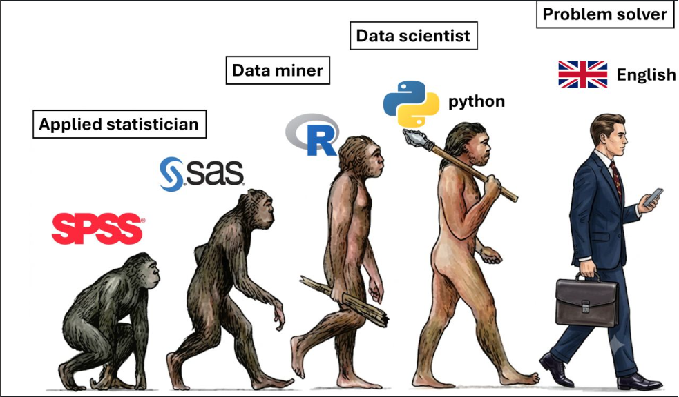

  
  <h1>🧠 Prompt Engineering for Data Pros</h1>
  
<em>Mastering "English" as the New Programming Language for Data Engineering & MLOps</em>

  
  
  
  

---

  <h3>The Evolution of the Problem Solver</h3>
  
  
<i>We evolved from SPSS ➡️ R ➡️ Python ➡️ English.</i>

---

## 📖 About This Repository (Σχετικά με το Project)

This repository is a **Masterclass** designed specifically for Data Engineers, Data Scientists, and MLOps Engineers. It embraces the philosophy that the modern "Problem Solver" doesn't just write raw code from scratch; they orchestrate Large Language Models (LLMs) using **Advanced Prompt Engineering** to generate code, design architectures, and debug pipelines.

*Αυτό το repository είναι ένας πλήρης οδηγός (Masterclass) που εξηγεί πώς τα "Αγγλικά είναι η νέα γλώσσα προγραμματισμού". Εδώ θα βρεις τα κορυφαία frameworks επικοινωνίας με την AI για να 10-πλασιάσεις την παραγωγικότητά σου.*

## 📚 Modules (Κεφάλαια)

Navigate through the folders to explore the frameworks and find copy-pasteable **Prompt Templates**:

1. [**01: Introduction to Prompting**](./01_Introduction_to_Prompting/) - The basics of LLMs, Tokens, and Temperature.
2. [**02: Zero and Few Shot Learning**](./02_Zero_and_Few_Shot_Learning/) - Providing examples to guide the model's output.
3. [**03: Chain of Thought Reasoning**](./03_Chain_of_Thought_Reasoning/) - Forcing the model to "think step-by-step" for complex SQL/Math.
4. [**04: ReAct Framework**](./04_ReAct_Framework/) - Reasoning + Acting. How to build autonomous Data Agents.
5. [**05: Code Generation & Debugging**](./05_Code_Generation_and_Debugging/) - Prompts specifically designed for Python, Pandas, and Airflow.
6. [**06: Data Architecture Design**](./06_Data_Architecture_Design/) - Using LLMs to design cloud architectures (AWS/GCP/Azure).
7. [**07: Self-Reflection & Correction**](./07_Self_Reflection_and_Correction/) - Forcing the LLM to review its own code for bugs.
8. [**08: RAG Prompting Strategies**](./08_RAG_Prompting_Strategies/) - How to prompt when passing internal documents/context safely.

---

## ⚡ The Ultimate Prompt Cheat Sheet

| Task / Problem | Best Framework | Example Magic Phrase |
|----------------|----------------|----------------------|
| **Parsing unstructured Logs to JSON** | Few-Shot Learning | *"Here are 3 examples of the input log and the exact output JSON I expect:"* |
| **Writing Complex SQL/Math** | Chain of Thought (CoT) | *"Let's think step by step before writing the final query."* |
| **Building an autonomous Agent** | ReAct Framework | *"Use this format: Thought, Action, Action Input, Observation."* |
| **Debugging Airflow/Python errors** | Contextual Zero-Shot | *"Here is my code, and here is the full stack trace. Analyze the root cause first."* |
| **Reviewing critical production code** | Self-Reflection | *"Act as a strict Senior Reviewer. Find 3 potential edge cases in the code you just wrote."* |
| **Querying internal company wikis** | RAG Delimiters | *"Answer the question using ONLY the data provided inside the `<context>` tags."* |

---

## 📓 Interactive Jupyter Playground

This repository isn't just text! It includes a live **Python Jupyter Notebook** where you can test these prompting frameworks directly against the OpenAI API.

**To run it locally:**
1. Clone the repo: `git clone https://github.com/karidasd/Prompt-Engineering-For-Data-Pros.git`
2. Install dependencies: `pip install -r requirements.txt`
3. Open `Prompt_Engineering_Playground.ipynb` in VS Code or Jupyter.
4. Add your OpenAI API key and start experimenting!

---

  <b>Built by <a href="https://karidasd.github.io/">Karydas</a></b> 
  <i>AI & Data Science Instructor / PhD Candidate</i>

